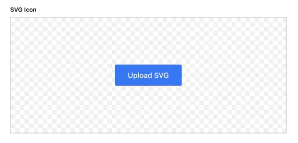
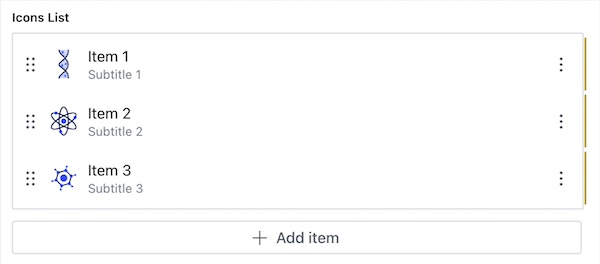

# sanity-plugin-inline-svg-input

**Sanity Studio v3** plugin to upload and preview inline SVGs.



## Installation

```sh
npm install @focusreactive/sanity-plugin-inline-svg-input
```

```sh
yarn add @focusreactive/sanity-plugin-inline-svg-input
```

```sh
pnpm add @focusreactive/sanity-plugin-inline-svg-input
```

## Usage

1. Add it as a plugin in `sanity.config.ts` (or .js):

```ts
import { defineConfig } from 'sanity'
import { inlineSvgInput } from '@focusreactive/sanity-plugin-inline-svg-input'

export default defineConfig({
  //...
  plugins: [inlineSvgInput()],
})
```

2. Use the `inlineSvg` type in your schema types:

```ts
// [...]
{
  fields: [
    // [...]
    {
      name: 'svgIcon',
      title: 'SVG Icon',
      type: 'inlineSvg',
    },
  ]
}
```

## Preview

### List view



To preview the SVG in the list view, you can use the `InlineSvgPreviewItem` component:

```tsx
const IconsListItem = defineType({
  type: 'object',
  name: 'iconsListItem',
  fields: [
    {
      type: 'string',
      name: 'title',
    },
    {
      type: 'string',
      name: 'text',
    },
    {
      type: 'inlineSvg',
      name: 'icon',
    },
  ],
  preview: {
    select: {
      title: 'title',
      subtitle: 'text',
      icon: 'icon',
    },
  },
  components: {
    preview: (props: PreviewProps<PreviewLayoutKey>) => {
      return <InlineSvgPreviewItem {...props} />
    },
  },
})

const IconsList = defineType({
  name: 'iconsList',
  type: 'array',
  of: [{ type: 'iconsListItem' }],
})
```

### Preview component

If you want to use the SVG in your preview component, you can use the `InlineSvgPreviewComponent`:

```tsx
import { InlineSvgPreviewComponent } from '@focusreactive/sanity-plugin-inline-svg-input'

export const PreviewComponent = ({ value }) => {
  return (
    //...
    <InlineSvgPreviewComponent value={value} />
    //...
  )
}
```

## Develop & test

This plugin uses [@sanity/plugin-kit](https://github.com/sanity-io/plugin-kit)
with default configuration for build & watch scripts.

See [Testing a plugin in Sanity Studio](https://github.com/sanity-io/plugin-kit#testing-a-plugin-in-sanity-studio)
on how to run this plugin with hotreload in the studio.

## Credits

This project was created at **FocusReactive** - the expert consultancy for the modern web. We specialize in helping clients beat the competition and accelerate business growth. With a deep expertise in headless CMS, NextJS, and eCommerce, we deliver cutting-edge solutions that prioritize your business goals.

### Our Expertise

- **Content-Centric Websites**: We have a deep experience building extendable, SEO optimized content and marketing websites with advanced CMS integrations and analytics.
- **Headless eCommerce**: Our next-generation, content-rich, and performant online eCommerce websites come with end-to-end integrations to power your digital business.
- **Headless CMS Consulting**: We offer multi-channel CMS development, modeling, customization, and support to help you manage your content seamlessly across various platforms.
- **Web Performance**: Our experts can audit, transform the architecture, and optimize your website to meet the 100 SCORE Core Web Vitals for exceptional web performance.

If you're looking for expertise in headless CMS, NextJS, or eCommerce, get in touch with **FocusReactive** today. Visit our website at [focusreactive.com](https://focusreactive.com/) to learn more about how we can help you accelerate your business growth.

<image src="https://github.com/focusreactive/MVP-NextJS13-New-Features/assets/14885189/7c67e385-3f79-43e3-ba27-bada1ebddf03" width="500px"/>

---

_This project is licensed under the MIT License. © 2023 FocusReactive._
